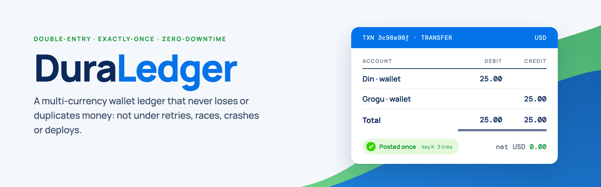
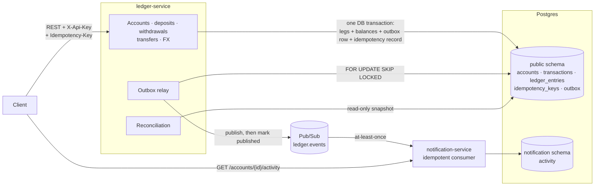
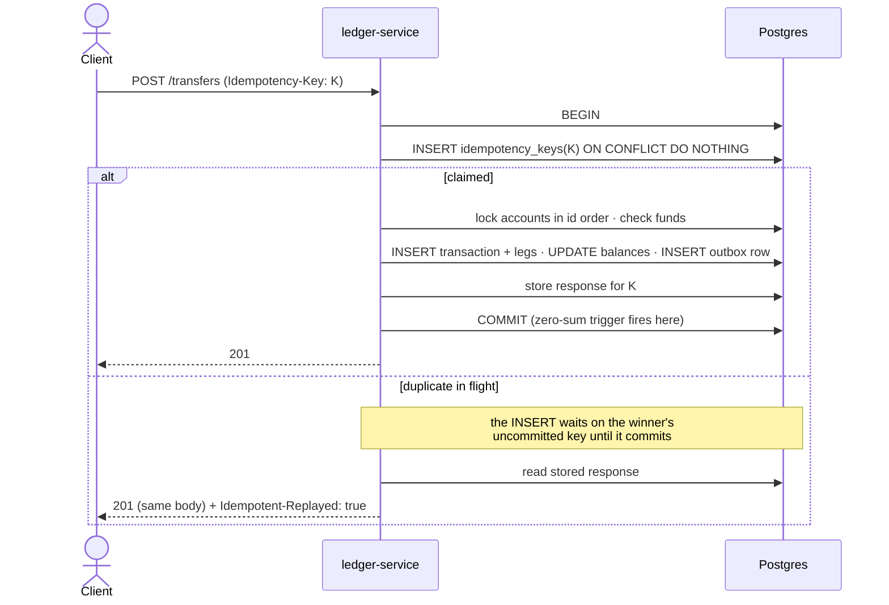
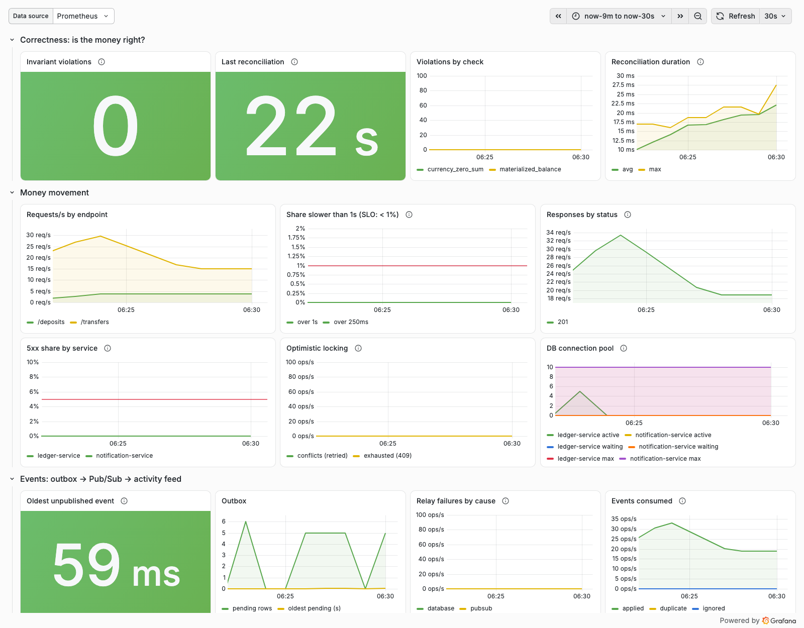
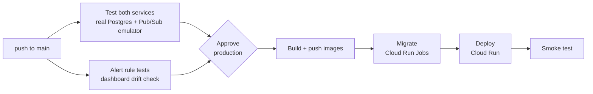

DuraLedger is a small but correct version of the core primitive behind digital banks and multi-currency wallets: double-entry accounts, idempotent money movement, and event-driven services. Every correctness claim below has a test that tries to break it, and the important ones have a **mutation check**: the protection was removed on purpose to confirm the test then fails.

[Run it locally](#run-it-locally) · [How money moves](#how-money-moves) · [Bugs I'm glad I found](#bugs-im-glad-i-found) · [](https://github.com/BhanuRana/DuraLedger/actions/workflows/ci.yml)

## Proof, not claims

| Claim | Evidence |
|---|---|
| A retried request never moves money twice | 20 concurrent identical requests → exactly **1** transaction |
| No overdraft under concurrency | 20 concurrent debits draining one account → exactly the affordable **10** succeed (without the row lock, 13 and 18 did) |
| The database itself refuses a bad ledger | Unbalanced postings, edits to entries, currency mismatches, negative balances: each rejected by Postgres, not just by Java |
| Corruption gets caught | A balance edited behind the ledger's back → reconciliation names it, and the alert fires in **25 s** |
| Hot accounts stay fast | **434 transfers/s on one account with 50,000 entries of history, p99 91 ms**: 4.2× faster after storing balances |
| Deploys drop nothing | **0 failed** of 3,386, 3,608 and 3,566 transfers while every ledger pod was replaced (130 of 3,527 failed before the fix) |
| Events are never lost | Transactional outbox: with Pub/Sub frozen, events wait in Postgres and drain on recovery |
| Alerts actually fire | 9 alerts, each **unit-tested** and each **made to fire** by breaking the running stack |
| Built to cost ≈ $0 idle | Scale-to-zero on Cloud Run, serverless Postgres and free tiers, behind a budget alert ([ADR 0006](docs/decisions/0006-cloud-run-neon-scale-to-zero.md)) |

## Repository layout

```
.
├── ledger-service/          Spring Boot · jOOQ (generated from a real migrated Postgres) · Flyway
├── notification-service/    Spring Boot · JdbcClient · Flyway (own schema)
├── observability/           alert rules + unit tests · dashboard as code · prove-alerts.sh
├── infra/gcp/               setup.sh · setup-ci.sh · deploy.sh
├── k8s/                     kind cluster · migration Jobs · apps · up.sh · rollout-test.sh
├── scripts/                 demo.sh · secret helpers
├── docs/                    decisions (ADRs) · banner, social preview, dashboard (sources in docs/brand/)
├── .github/workflows/       CI/CD
├── docker-compose.yml       local infrastructure; --profile app adds both services and Grafana
└── BUILD_LOG.md             dated engineering journal: decisions, measurements, bugs
```

## Tech stack

| | |
|---|---|
| Services | Java 21, Spring Boot 4.1: `ledger-service` and `notification-service` |
| Data | PostgreSQL 18, jOOQ (classes generated from the real migrated schema), Flyway |
| Events | GCP Pub/Sub (the emulator locally and in tests) |
| Runtime | Cloud Run with Neon serverless Postgres; the same images on Kubernetes (`kind`) |
| Observability | Micrometer over OTLP to Grafana; alert rules and dashboard as code |
| Testing | JUnit 5, Spock, Testcontainers (real Postgres + Pub/Sub emulator), `promtool` |
| CI/CD | GitHub Actions, keyless deploys through Workload Identity Federation |

## Architecture



- **ledger-service** is the system of record: accounts, the ledger, money movement, the outbox.
- **notification-service** builds each wallet's activity feed *only* from events. It owns its schema and never reads the ledger's tables; the event is the only contract.
- **Postgres enforces the money invariants itself** (constraint triggers, CHECKs, composite FKs), so a bug in Java can't commit a bad ledger. Why: [ADR 0001](docs/decisions/0001-enforce-ledger-invariants-in-postgres.md).

## How money moves

Every money movement is one database transaction whose **legs net to zero per currency**. Amounts are integer minor units (cents) with the sign in `direction`, and a deferred constraint trigger checks the sum at `COMMIT`.

**A transfer of 25.00 USD from Din to Grogu:**

| Account | Direction | Amount (USD cents) |
|---|---|---:|
| Din · USD | DEBIT | 2,500 |
| Grogu · USD | CREDIT | 2,500 |
| | **net USD** | **0** |

**Money from outside** (deposits, withdrawals) posts against a per-currency `EXTERNAL_CLEARING` account, so even money entering or leaving the system is double-entry.

**Converting 20.00 USD to HKD at 7.80** is four legs through per-currency `FX_POOL` accounts, because a USD leg and an HKD leg can never cancel each other ([ADR 0002](docs/decisions/0002-fx-through-per-currency-pools.md)):

| Account | Direction | Amount |
|---|---|---:|
| Din · USD | DEBIT | 2,000 ¢ |
| FX pool · USD | CREDIT | 2,000 ¢ |
| FX pool · HKD | DEBIT | 15,600 ¢ |
| Din · HKD | CREDIT | 15,600 ¢ |
| | **net per currency** | **0 and 0** |

Rates are `BigDecimal` end to end and conversions **round down** to a whole cent, so the house keeps the sub-cent remainder and repeated tiny conversions can't drain the pool. The rate used is stored on the transaction.

## API

Every endpoint needs `X-Api-Key` (locally: `local-dev-key`); money-moving ones also need an `Idempotency-Key`. Errors are RFC 9457 `application/problem+json` with stable types such as `urn:duraledger:problem:insufficient-funds`.

| Endpoint | |
|---|---|
| `POST /accounts` | Create a wallet (one per user per currency: HKD, USD, EUR, GBP) |
| `GET /accounts/{id}` · `GET /accounts/{id}/balance` | A wallet and its balance |
| `POST /deposits` · `POST /withdrawals` | Money in and out |
| `POST /transfers` | Same-currency transfer |
| `POST /fx-convert` | Convert into the same user's wallet in another currency |
| `GET /transactions/{id}` | A transaction and its ledger legs |
| `GET /accounts/{id}/activity` | The wallet's activity feed (notification-service) |

## Correctness

### The invariants, and where each one is enforced

| Invariant | Enforced by | Proven by |
|---|---|---|
| Every transaction nets to zero **per currency** | Deferred constraint trigger at `COMMIT` | An unbalanced posting is rejected and nothing persists; a naive 2-leg FX posting is rejected |
| Ledger entries are immutable | Trigger refuses `UPDATE` / `DELETE` / `TRUNCATE` | Schema spec |
| An entry's currency matches its account's | Composite FK `(account_id, currency)` | Schema spec |
| Amounts are positive integers; sign lives in `direction` | `bigint` + `CHECK (amount_minor > 0)` | Schema spec |
| A user balance never goes negative | Row lock + funds check; `CHECK (balance_minor >= 0)` as the last line of defence | 20 concurrent debits, exactly the affordable 10 succeed (mutation-checked) |
| One request, one effect, however often it's retried | Idempotency key claimed inside the money movement's transaction | 20 concurrent identical requests → 1 transaction |
| The whole ledger nets to zero, and every stored balance equals its entries | **Reconciliation**, continuously | Tests that corrupt the ledger on purpose, including with triggers disabled |

### Idempotency: exactly one effect per key

A client can't tell "the transfer failed" from "it succeeded but the response was lost", so every money-moving endpoint requires an `Idempotency-Key` ([ADR 0003](docs/decisions/0003-idempotency-key-claimed-inside-the-transaction.md)).



Claiming the key **inside** the same transaction means:
- **No polling:** a concurrent duplicate simply waits on Postgres's own unique-index lock.
- **No stuck keys:** a crash rolls the claim back together with everything else.
- **Sticky outcomes:** a refusal like `insufficient-funds` is stored and replayed too, so a key never flips from "declined" to "done".

A key reused with a *different* body is rejected (422), detected by a hash of the endpoint and body.

### Concurrency: two strategies, measured

Both strategies are built and the whole API suite runs under each: **pessimistic** (`SELECT … FOR UPDATE`, accounts locked in id order) and **optimistic** (version compare-and-set, retried with jittered backoff). Pessimistic is the default ([ADR 0004](docs/decisions/0004-pessimistic-locking-by-default.md)).

32 concurrent clients, 2,000 transfers per scenario, real HTTP against Postgres:

| Mode | Scenario | req/s | p99 | Gave up |
|---|---|---:|---:|---:|
| pessimistic | one hot account | 399 | 100 ms | 0 |
| pessimistic | one hot account with 50,000 entries of history | **434** | **91 ms** | **0** |
| pessimistic | spread over many accounts | 1,567 | 43 ms | 0 |
| optimistic | one hot account | 254 | 444 ms | 12% |
| optimistic | spread over many accounts | 1,551 | 55 ms | 0 |

The two tie when nothing conflicts. On a hot account, optimistic makes most clients do the work and throw it away, over and over, and 12% of payments fail.

**The benchmark found a bigger problem than locking.** Balances started as a `SUM` over the account's entries: **O(history)**, computed *while holding the lock*. The account with 50,000 entries managed only **104 req/s**. Storing the balance on the account row, updated in the same transaction, took it to **434 req/s** and made throughput independent of history ([ADR 0005](docs/decisions/0005-materialize-account-balances.md)). The entries remain the source of truth; reconciliation verifies the stored copy.

### Events: outbox → Pub/Sub → idempotent consumer

- **Outbox:** each posting writes its event in the *same* transaction as the ledger legs. An event can't be lost, and can't announce a change that rolled back.
- **Relay:** publishes committed rows and marks them only after Pub/Sub acknowledges. `FOR UPDATE SKIP LOCKED` lets replicas split the work without double publishing.
- **Consumer:** delivery is at-least-once, so notification-service is idempotent on `(event_id, account_id)`. Unknown event types are counted and acknowledged, never retried forever.

### Reconciliation: the ledger checks itself

A scheduled job reads one `REPEATABLE READ` snapshot and checks two things:
1. For every currency, credits minus debits across **all** entries is exactly zero.
2. Every stored balance equals the sum of its account's entries.

Check 1 is stronger than the per-transaction trigger, because it doesn't care *how* an entry got there. A test writes a one-sided +999 USD entry with triggers disabled and quietly "fixes" the stored balance: check 2 stays silent, and check 1 reports USD off by exactly 999. The job is deliberately *not* a readiness probe: failing readiness would pull every replica out of service and halt all payments.

## Observability: every alert made to fire

Services **push** metrics over OTLP (a scaled-to-zero service has nothing to scrape) to Grafana Cloud in production and to a local Grafana + Prometheus in development. Alert rules and the dashboard are code: [`observability/`](observability).



| Alert | Fires when | Made to fire by |
|---|---|---|
| **LedgerInvariantViolated** | Reconciliation finds an imbalance or a drifted balance | Editing a balance in SQL behind the ledger's back |
| **ReconciliationStale** | The check itself stopped running | Delaying the job by 24 h |
| **OutboxBacklogStuck** · **OutboxPublishFailing** | Events committed but not reaching Pub/Sub | Pausing Pub/Sub |
| **HighServerErrorRate** | > 5% 5xx for 2 min | Stopping Postgres under load |
| **MoneyMovementSlow** | > 1% of money-moving requests over 1 s | Another transaction holding the account's row lock |
| **TransferRetriesExhausted** | Optimistic locking refused a valid transfer | 20 concurrent transfers with one attempt allowed |
| **ApiKeyProbing** · **ClientsRateLimited** | Key guessing / clients over their limit | Scripted wrong-key and over-limit traffic |

Every rule has `promtool` unit tests (a firing case and a near-miss each), and [`prove-alerts.sh`](observability/prove-alerts.sh) breaks the running stack in nine ways and waits for each alert to reach FIRING. Its first run found three of the bugs below.

## Bugs I'm glad I found

Each was caught by a test, a benchmark or a deliberate failure, and each is its own `fix:` commit or dated entry with the numbers in [BUILD_LOG.md](BUILD_LOG.md).

| What went wrong | How it surfaced | Fix | Evidence |
|---|---|---|---|
| Concurrent transfers overdrew an account | Concurrency test | Row lock on the source account | 13 and 18 of 20 succeeded; now exactly 10 |
| A refusal could flip to success on retry | Replaying a declined request after funds arrived | Store and replay refusals too | One key, one outcome |
| Balance query was O(history), under the lock | Locking benchmark | Store the balance, update it in the same transaction | 104 → 434 req/s |
| Opposite transfers (A→B, B→A) deadlocked | Opposite-direction test | Lock and update accounts in id order | Mutation: insertion order brought back 30–46 deadlocks per run |
| Errors on every shutdown | Reading a green test run's log | Stop the relay on `ContextClosedEvent`, before its dependencies close | 114 errors → 0 |
| Stopping one service stopped the database under the other | Running both services | Compose `start-only` lifecycle | notification-service stays UP |
| Tests on Postgres 16, production on 18.6 | Reading the version production reported | Pin every test and codegen to 18 | Whole suite green on 18 |
| A pod crashed creating the same topic at once | First Kubernetes boot | Create and treat `ALREADY_EXISTS` as success | 8 simultaneous creators; the old code failed 3 of 3 runs |
| Rolling deploys dropped requests | Rollout under load | `preStop` sleep before graceful shutdown | 130 of 3,527 failed → 0 in 3 runs |
| App crashed at startup with metrics export on, all tests green | First run with export enabled | Align protobuf versions; a test that boots with export on | Both services exited; now they start |
| A database outage hung every request for 30 s | Making the 5xx alert fire | Fail fast on connection acquisition | 30.03 s → 3.0 s; the alert fires |
| Counter alerts missed events from new instances | An alert that didn't fire with 17 events behind it | Count the value a new series is born with | Unit test + live proof |
| A database outage was reported as "Pub/Sub failing" | Live alert proof | Tag relay failures by cause | False alarm in 21 s → none; a Pub/Sub outage still fires |

## Running in production

**Cloud Run, designed for ≈ $0/month idle** (scripts in [`infra/gcp/`](infra/gcp), reasoning in [ADR 0006](docs/decisions/0006-cloud-run-neon-scale-to-zero.md)):

| Concern | How |
|---|---|
| Compute | Cloud Run, 0–2 instances per service (caps cost and database connections) |
| Database | Neon serverless Postgres 18 in the same city as Cloud Run; a transfer makes ~8 database round trips |
| Migrations | Flyway image run as a Cloud Run Job **before** each rollout; services never migrate on boot |
| Background work | No CPU between requests, so events publish right after commit, and Cloud Scheduler calls OIDC-protected task endpoints (outbox sweep, reconciliation) |
| Events | Pub/Sub push to notification-service, OIDC-signed, with retry backoff and a dead-letter topic |
| Secrets and identity | Secret Manager; one service account per role; no key files anywhere |
| Exposure | Public: health only. API: key + per-key rate limit. Tasks and push: Google-signed tokens from allow-listed accounts |
| Cost guardrail | Budget alert before anything billable exists |

The same images run in both modes, chosen by configuration: locally the relay, reconciliation and consumer run on background threads, and under the `gcp` profile they become requests. `CloudRunModeTests` runs the whole service with no scheduler at all.

**Kubernetes** (the same images on a local `kind` cluster, [`k8s/`](k8s)): Postgres as a StatefulSet, migration Jobs that must complete before apps start, `maxUnavailable: 0` rollouts, startup/readiness/liveness probes, memory request = limit, no CPU limit, and a `preStop` hook. `k8s/rollout-test.sh` replaces every ledger pod under load and requires every transfer to succeed.

**CI/CD** ([`.github/workflows/ci.yml`](.github/workflows/ci.yml)):



GitHub Actions authenticates to GCP with **Workload Identity Federation**: no service-account key exists, and GCP only accepts tokens minted for this repository's `main` branch.

## Run it locally

Prerequisites: JDK 21 and Docker. The ledger build generates jOOQ classes from a migrated Postgres container, so **Docker must be running to build**.

```bash
# Build both services (runs the full test suites against real Postgres + Pub/Sub emulator)
(cd ledger-service && ./mvnw verify) && (cd notification-service && ./mvnw verify)

# Everything from images: Postgres, Pub/Sub emulator, both services, Grafana (:3000), Prometheus (:9090)
docker compose --profile app up --build

./scripts/demo.sh                          # the whole story, end to end
open http://localhost:3000/d/duraledger    # dashboard
./observability/prove-alerts.sh            # break the stack 9 ways, watch each alert fire (~20 min)
./k8s/up.sh && ./k8s/rollout-test.sh       # same images on kind, zero-downtime rollout under load
```

`./scripts/demo.sh` runs the whole story: the API key check, a transfer as two legs, a retried request replayed, a reused key and an overdraft refused, 10 simultaneous identical requests executing once, a withdrawal, an FX conversion, both activity feeds and a live reconciliation.

## Testing

94 tests plus 27 alert-rule assertions. Everything runs against **real Postgres 18 and the real Pub/Sub emulator** through Testcontainers: the guarantees depend on real locking and trigger semantics, so there are no in-memory fakes.

| Suite | What it proves |
|---|---|
| `LedgerSchemaSpec` (Spock) | Every database invariant, each by trying to break it |
| `MoneyMovementApiTests` | Deposits, withdrawals, transfers, FX and the concurrency proofs over real HTTP |
| `OptimisticMoneyMovementApiTests` | The same suite under optimistic locking |
| `ReconciliationTests` | Deliberate corruption is caught with exact amounts |
| `OutboxRelayTests` | Events arrive and are marked; concurrent topic creation; failures counted by cause |
| `ActivityFeedTests` · `PushDeliveryTests` | Feed projection, duplicate delivery, unknown event types, push acknowledgement |
| `CloudRunModeTests` · `GoogleOidcInvokerVerifierTests` | Serverless mode works without timers; forged and `alg=none` tokens are refused |
| `ApiKeyTests` · `FixedWindowRateLimiterTests` | 401 before any database work, key rotation, 429 with `Retry-After` |
| `MetricsExportTests` | Each service boots with metrics export on |
| Alert rules (`promtool test rules`) | Each alert fires when it should and not on a near-miss |
| `LockingBenchmark` | On demand: `./mvnw test -Dtest='*LockingBenchmark'` |

## At 10× scale, and what's deliberately out

**What I'd change as load grows:**
- **Hot accounts** top out near 430 transfers/s, set by about 2.5 ms of lock hold time per transfer, now mostly round trips and the commit flush. Next: one statement per transfer, a conditional `UPDATE … WHERE balance >= amount`, or batching several transfers per commit.
- **Reconciliation** is a full scan. At scale it would checkpoint a verified total at an entry id and check only newer entries.
- **The relay** would become change data capture (tailing the write-ahead log), removing polling entirely.
- **A single primary** eventually limits writes. Shard by account id; transfers across shards become a saga through clearing accounts.

**Out of scope on purpose:** real payment rails, card networks and KYC (this is a domain simulation, not a licensed product); an end-user identity provider; live FX market data. Cutting them keeps the effort on the part that's hardest to get right: the ledger.

## Docs

- [`docs/decisions/`](docs/decisions): six architecture decision records
- [`BUILD_LOG.md`](BUILD_LOG.md): the dated engineering journal, including every measurement above
- [`observability/README.md`](observability/README.md): the alerts, and the non-obvious parts of OTLP metrics

## License

Apache 2.0
